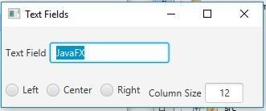

# 16.6 TextField

Write a program that sets the horizontal alignment and column-size properties of a text field dynamically.

## Example Output

## Analysis Steps

I needed to create radio buttons and text fields to recreate the example image that was given in the assignment

### Design

I needed to define 2 hboxes one that would hold the textfield and label for "JavaFX" which would be the item that would be manipulated
by my second hBox that would hold radio buttons to control the position, and the column size text field that would change the amount of
colums the first hBox holds.

### Testing

First, I got the first text box created, set the scene and tested the program to see if it was placed
Second, I created the radio buttons, then check to see if they were showing up.
Third, I created the handler for the radio buttons. I checked to make sure they were working
Fourth, I created the column size textField. Again, I made sure it would show up in the bottom hBox
Fifth, I made the handler that would control the function for the column size(this was tricky trying to figure out how to grab the value of the textField)
Lastly, I worked to adjusting orientation of the labels, and the other objects on the screen.
